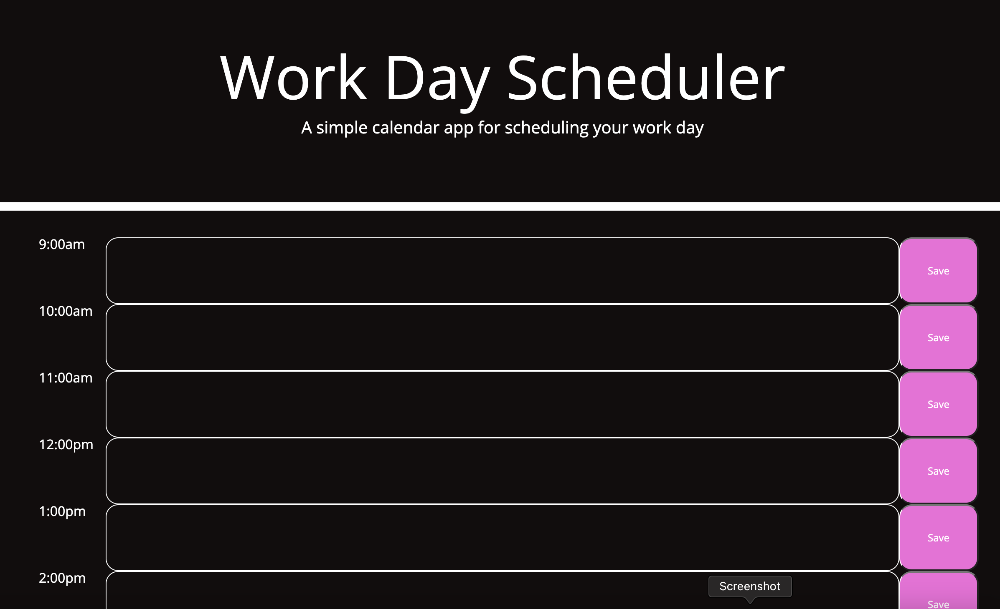
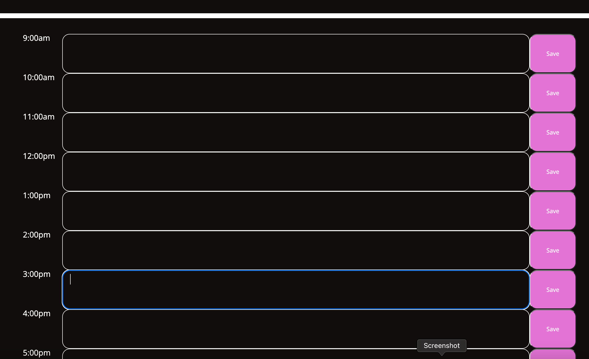

# Work-Day-Scheduler

# Unit 05 Third-Party APIs: Work Day Scheduler

## Objectives

Create a simple calendar application that allows a user to save events for each hour of the day by modifying starter code. This app will run in the browser and feature dynamically updated HTML and CSS powered by jQuery.

using the [Moment.js](https://momentjs.com/) library to work with date and time. 

- Use a daily planner to create a schedule
- The current day is displayed at the top of the calendar
- User is then presented with time-blocks for standard business hours
- Each time-block should be color coded to indicate whether it  is in the past, present, or future
- After clicking into a time-block user should be able to enter - an event
- User should be able to save that time-block
- The text for that event is to be saved in local storage

## Decriptive links and Screenshots

The following animation demonstrates the application functionality:

## Contributions

- Eugene
- Dev wuf
- Jasmine B

## licensing

This code is licensed under the MIT.

